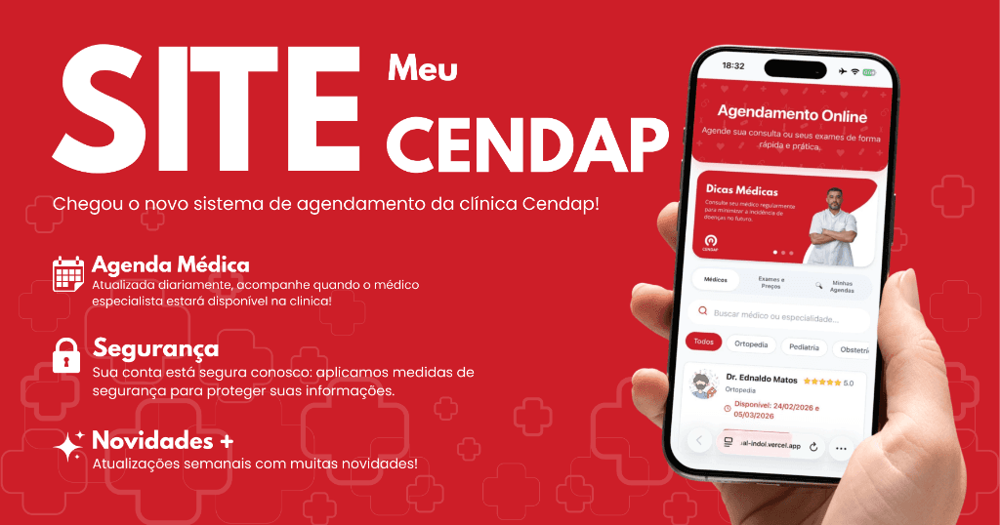
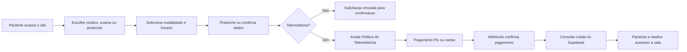

# Agendamento Virtual CENDAP

<p align="center">
  
</p>

<p align="center">
  <a href="https://nextjs.org/">
    
  </a>
  <a href="https://react.dev/">
    
  </a>
  <a href="https://www.typescriptlang.org/">
    
  </a>
</p>

Sistema web para agendamento online da CENDAP, com consultas presenciais, exames, protocolos, lista de espera, telemedicina, pagamento online, area do paciente, envio de exames e painel medico.

O projeto foi pensado para reduzir atrito no atendimento: o paciente escolhe o servico, informa seus dados, confirma o agendamento e acompanha seus atendimentos em uma experiencia simples e responsiva.

---

## Visao Geral

| Area | O que entrega |
| :--- | :--- |
| Site publico | Paginas institucionais, especialidades, protocolos, exames e chamada para agendamento. |
| Agendamento | Fluxo guiado para consulta, retorno, telemedicina, exame ou protocolo. |
| Telemedicina | Aceite da politica, pagamento online, sala Daily e acompanhamento pelo perfil. |
| Area do paciente | Login, historico de agendamentos, consultas, exames enviados e documentos recebidos. |
| Painel medico | Visualizacao de consultas, acesso a sala, exames do paciente e envio de documentos. |
| Analytics medico | Relatorio operacional com indicadores, filtros e exportacao em PDF. |
| Backoffice leve | Dados de agenda e servicos consumidos via Google Sheets. |

---

## Funcionalidades

### Para pacientes

- Agendamento de consultas presenciais, retornos, telemedicina, exames e protocolos.
- Busca por medicos, especialidades e servicos.
- Preenchimento automatico de dados para pacientes logados.
- Aceite da Politica de Telemedicina antes do pagamento.
- Pagamento online para telemedicina via Asaas, com Pix e cartao.
- Area do paciente com historico de atendimentos.
- Envio de exames e documentos em PDF, PNG, JPEG, WEBP ou HEIC.
- Acesso a documentos emitidos pelo medico.
- Lista de espera para horarios indisponiveis.

### Para a equipe medica

- Painel de telemedicina com consultas vinculadas ao paciente.
- Abertura de sala online com permissao de medico.
- Visualizacao de exames enviados pelo paciente.
- Envio de documentos medicos para o paciente.
- Configuracao de assinatura, carimbo e dados profissionais.
- Relatorio de consultas, pagamentos e atendimentos por periodo.
- Exportacao de relatorios em PDF.

### Para operacao da clinica

- Agenda e servicos sincronizados com Google Sheets.
- Webhook de pagamento para confirmar telemedicina.
- Persistencia de pacientes, pagamentos, consultas e documentos no Supabase.
- Paginas legais de Termos de Uso, Privacidade e Politica de Telemedicina.
- Eventos de marketing e conversao com Google/Facebook Pixel.

---

## Fluxo Principal



---

## Tecnologias

| Camada | Tecnologias |
| :--- | :--- |
| Aplicacao | Next.js 16, React 19, TypeScript |
| UI | CSS Modules, CSS responsivo, lucide-react |
| Dados publicos | Google Sheets, PapaParse |
| Banco e auth | Supabase Auth, Postgres, Row Level Security |
| Arquivos | Supabase Storage |
| Pagamentos | Asaas API e webhook |
| Telemedicina | Daily API |
| Relatorios | Recharts, jsPDF, jspdf-autotable |
| Marketing | Google third-parties, Facebook Pixel |
| Qualidade | ESLint |

---

## Estrutura do Projeto

```text
src/
  app/
    api/                    # Rotas server-side: pagamentos, webhooks, uploads, telemedicina
    doctor-analytics/       # Relatorios medicos
    doctor-panel/           # Painel medico
    login/                  # Autenticacao do paciente
    privacidade/            # Politica de privacidade
    telemedicina/           # Politica de telemedicina
    termos/                 # Termos de uso
    page.tsx                # Home publica
  components/
    SchedulingModal.tsx     # Fluxo principal de agendamento
    ProfileModal.tsx        # Area do paciente
    DoctorCard.tsx          # Cards de medicos
    ServiceCard.tsx         # Cards de exames/servicos
    WaitlistModal.tsx       # Lista de espera
  contexts/
    AuthContext.tsx         # Sessao Supabase
  lib/
    sheets.ts               # Leitura do Google Sheets
    supabase.ts             # Cliente Supabase
    telemedicine.ts         # Integracao Daily
public/                     # Imagens, banners, logos, avatares e assets
supabase.sql                # Base inicial do banco Supabase
google_apps_script.js       # Script auxiliar para Google Sheets
```

## Rotas Importantes

| Rota | Descricao |
| :--- | :--- |
| `/` | Pagina inicial e entrada do fluxo de agendamento. |
| `/login` | Login e cadastro do paciente. |
| `/doctor-panel` | Painel medico. |
| `/doctor-analytics` | Relatorios e indicadores medicos. |
| `/telemedicina` | Politica de Telemedicina. |
| `/privacidade` | Politica de Privacidade. |
| `/termos` | Termos de Uso. |
| `/consulta-encerrada` | Retorno apos encerramento da sala online. |

---

## APIs Internas

| Endpoint | Funcao |
| :--- | :--- |
| `POST /api/checkout-asaas` | Cria pagamento de telemedicina no Asaas. |
| `POST /api/webhooks/asaas` | Recebe eventos de pagamento aprovado. |
| `POST /api/telemedicine/room` | Cria ou abre sala Daily com controle de acesso. |
| `POST /api/patient-exams/upload` | Recebe exames enviados pelo paciente. |
| `POST /api/doctor-documents/upload` | Envia documentos medicos ao paciente. |
| `GET /api/doctor-documents/view/[token]` | Exibe documento por token de validacao. |
| `GET /api/doctor-analytics` | Consolida dados para relatorios. |

## Integracoes

### Google Sheets

Usado como fonte simples de agenda, disponibilidade, servicos e informacoes operacionais. A aplicacao le os dados como CSV e revalida periodicamente.

### Supabase

Usado para autenticacao, perfis, pagamentos, telemedicina, uploads de exames, documentos medicos e configuracoes do medico.

### Asaas

Usado para gerar cobrancas da telemedicina e confirmar pagamentos via webhook.

### Daily

Usado para criar salas privadas de telemedicina e tokens de acesso para paciente e medico.

---

## Qualidade e Validacao

Antes de abrir um pull request ou publicar:

```bash
npm.cmd run lint
npm.cmd run build
```

Verificacoes recomendadas:

- Fluxo de agendamento presencial.
- Fluxo de telemedicina com aceite da politica.
- Criacao de pagamento e retorno do webhook.
- Login do paciente.
- Envio de exame pelo paciente.
- Abertura da sala pelo medico.
- Emissao e visualizacao de documento medico.
- Visualizacao mobile do modal de agendamento.

---

## Observacoes de Seguranca

- Chaves administrativas devem ficar somente no servidor.
- Webhooks de pagamento devem validar segredo sempre que possivel.
- Arquivos enviados por pacientes precisam respeitar limite de tamanho e tipo.
- Dados de saude exigem cuidado com LGPD, consentimento, acesso minimo e retencao adequada.
- Politicas RLS do Supabase devem ser revisadas antes de producao.

---

## Status

Projeto em evolucao ativa para uso operacional da CENDAP.

Principais modulos ja presentes:

- Site publico responsivo.
- Agendamento online.
- Login e area do paciente.
- Telemedicina com pagamento.
- Envio de exames.
- Painel medico.
- Documentos medicos.
- Relatorios e exportacao PDF.

---

## Licenca

Este repositorio nao declara uma licenca publica. O uso, copia, distribuicao ou modificacao depende de autorizacao do proprietario do projeto.
